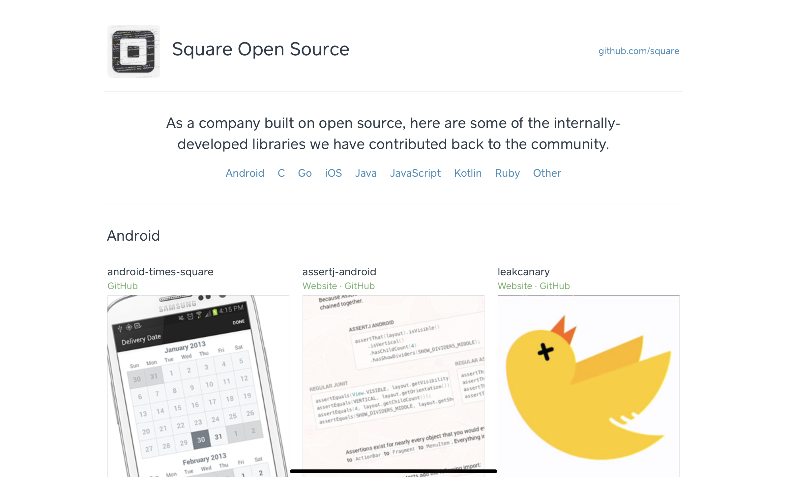

# トップページレイアウトの作成
GitHub Pagesで運用するブログのトップページの作り込みの記録.  
こんな感じのトップページにしたい. 


`_posts`ディレクトリにブログ記事を投稿すると、topページのスクエアの部分にサムネイル画像とタイトルと要旨が表示されるようにしたい.  
ブログ投稿のたびにtopページのHTMLファイルを修正していたらとても面倒なので、投稿と同時に自動表示してくれるようにしたい.  


## 投稿を自動反映
`site.posts`で全ての投稿を抽出できるので、下記の書き方で自動反映できる.  
```liquid

  <li>
	{{ post.url }}
	{{ post.title }}
	{{ post.description}}
  </li>

```

と思ったら、リンクが、`https://tker-78.github.io/2022/07/25/sample-text.html`と変換されていてアクセスできない.  
解消方法は下記の`リンクの指定方法`を参照.  

### パーシャルを指定する
`_includes/partial.html`
```html
<li class="menu-item">
  <div class="menu-item-info">
    <h4 class="menu-item-name">{{ post.title }}</h4>
    <span class="menu-item-price"><a href="2022/07/25/sampletext.html" target="_blank">link</a></span>
    <p class="menu-item-description">{{ post.description }}</p>
  </div>
  <div class="menu-item-image has-meta-content">
    
  </div>
</li>
```


`_layouts/default.html`
```html
 
  

```
こんな感じで、`{{ post.title }}`を指定している.  

### サムネイル画像の指定
トップページに表示するサムネイル画像を指定する.  


### リンクの指定方法
#### aタグの場合
`yyyy-mm-dd-title.md`のファイルの場合、自動的にパスは`yyyy/mm/dd/title.html`に変換されるため、`aタグ`内では変換後のパスを指定すれば通る.  

#### 画像の場合
画像は絶対パスで参照されるので、`Liquid`を使用して`imgタグ`内に
```html

```
のように指定する.  

_config.ymlで、
```yaml
url: https:~~~
baseurl: /blog
```
のように指定する

